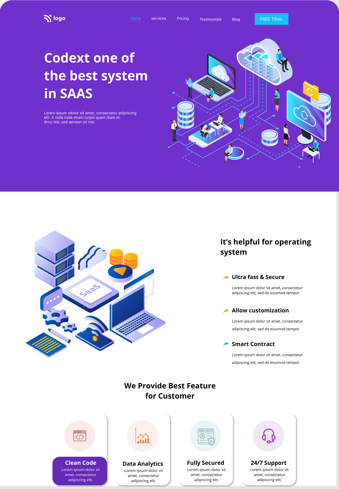

## INEURON_CHALLENGE-PROJECT-13

---

## Project 13

---

## What I learned from this Project?

- Learnd about **cards**.
- Learnd about **svg image**.
- Learnd about customizing **svg fill color**.
- Learnd about create and use css **variables**.

---

# Time to finish this project

---
# Screenshots
